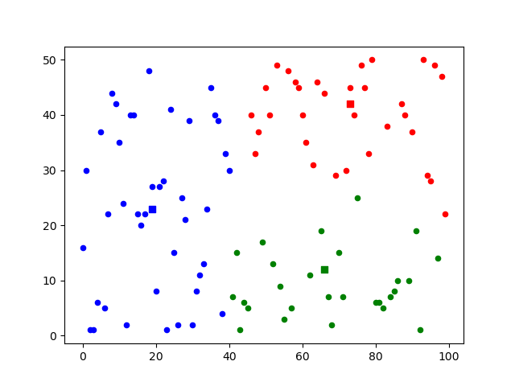
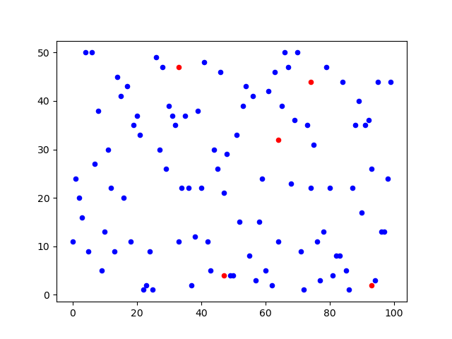

# K-means algorithm implementation

## Description
* The code will generate a random data set with 100 points and initially assign 'k' centroids randomly. 
* The K-means algorithm will then run for 5 iterations, in each run refining the position of centroids.  
* After each iteration, a graph will be plotted to show the current state of centroid positions.

## Results

### Run-1 (k = 3)

  
  

Three points are chosen randomly as centroids which are depicted by the red dots. Based on the inital position of centroids, the points are separated into 3 clusters. The square shapes represent the centroids in the second image.

   
  
   
  

The result after 2-5 iteration are shown above. It can be seen that the centroids' position almost stabilises after 4th iteration.

### Run-2 (k = 5)

  
  

From the data it appears that 4 clusters should be sufficient, but with k equal to 5, one more cluster is squeezed in (green one).

   
  
   
  

