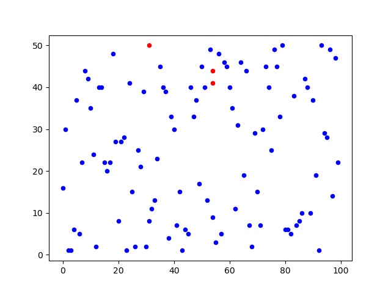
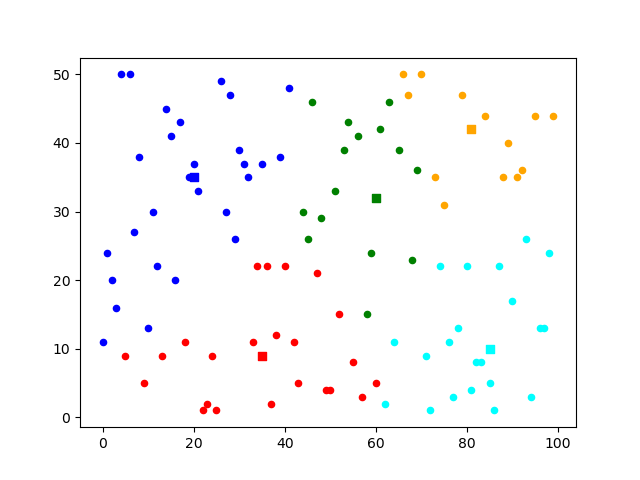
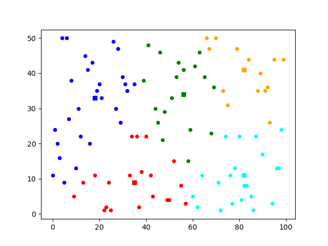

# Kmeans

## Description
* The code will generate a random data set with 100 points and initially assign 'k' centroids randomly. 
* The Kmeans algorithm will then run for 5 iterations, in each run refining the position of centroids.  
* After each iteration, a graph will be plotted to show the current state of centroid positions.

## Results

### Run-1

  
  

   
  
   
  

### Run-2

  
  

   
  
   
  

